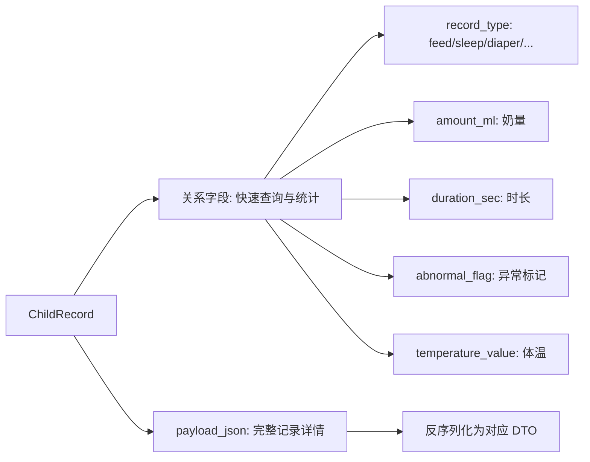
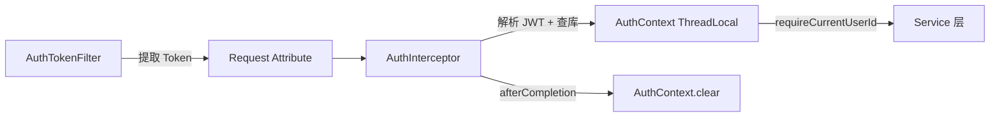

# 架构与设计

## 分层架构

项目采用经典的 Controller → Service → Mapper 三层架构：

```
┌─────────────────────────────────────────────────┐
│                   Filter 链                      │
│  CorsFilter → RequestLoggingFilter → AuthTokenFilter │
└──────────────────────┬──────────────────────────┘
                       │
┌──────────────────────▼──────────────────────────┐
│              Interceptor 拦截器                    │
│           AuthInterceptor (JWT 验证)              │
└──────────────────────┬──────────────────────────┘
                       │
┌──────────────────────▼──────────────────────────┐
│                  Controller 层                    │
│  AuthController / BabyController / RecordController / UploadController │
└──────────────────────┬──────────────────────────┘
                       │
┌──────────────────────▼──────────────────────────┐
│                   Service 层                      │
│  AuthServiceImpl / BabyServiceImpl / RecordServiceImpl / OssService │
└──────────────────────┬──────────────────────────┘
                       │
┌──────────────────────▼──────────────────────────┐
│                   Mapper 层                       │
│  AppUserMapper / BabyMapper / ChildRecordMapper / ChildNoteMapper │
└──────────────────────┬──────────────────────────┘
                       │
                  ┌────▼────┐
                  │  MySQL  │
                  └─────────┘
```

## 请求处理流程

### 1. Filter 阶段（Servlet 级别）

请求进入时依次经过三个 Filter：

| Filter | 顺序 | 职责 |
|--------|------|------|
| `CorsFilter` | 最先 | 处理跨域，设置 CORS 响应头，OPTIONS 直接返回 200 |
| `RequestLoggingFilter` | 中间 | 记录请求日志（方法、URL、请求体） |
| `AuthTokenFilter` | 最后 | 从请求中提取 Token，存入 Request Attribute |

### 2. Interceptor 阶段（Spring MVC 级别）

`AuthInterceptor` 拦截 `/api/**` 路径（排除 `/api/auth/wx-login`）：

1. 从 Request Attribute 获取 Token
2. 解析 JWT，验证签名和过期时间
3. 查询数据库确认用户存在
4. 将 `AuthUser` 存入 `AuthContext`（ThreadLocal）和 Request Attribute
5. 请求完成后在 `afterCompletion` 清除 ThreadLocal

### 3. Controller → Service → Mapper

标准三层调用，Service 层通过 `AuthContext.requireCurrentUserId()` 获取当前用户 ID 实现数据隔离。

## 核心设计决策

### 记录类型：单表 + JSON Payload

所有记录类型存储在同一张 `child_record` 表中，采用 **关系字段 + JSON 扩展** 的混合策略：

- **关系字段**（`record_type`, `record_sub_type`, `amount_ml`, `duration_sec` 等）：用于统计查询和索引过滤
- **JSON 字段**（`payload_json`）：存储完整的记录详情，灵活适配不同记录类型



**优势**：
- 避免为每种记录类型建表，简化数据库结构
- 关系字段支持索引查询，JSON 字段保持扩展性
- 新增记录类型只需添加 DTO 和 Service 逻辑，无需 DDL 变更

### JWT 自实现

项目未使用第三方 JWT 库，而是基于 `javax.crypto.Mac`（HMAC-SHA256）自行实现：

- **Header**: `{"alg":"HS256","typ":"JWT"}`
- **Payload**: `{"uid":用户ID,"openid":"微信openid","exp":过期时间戳}`
- **签名**: HMAC-SHA256，使用 `constantTimeEquals` 防止时序攻击

### 数据隔离

所有数据操作都通过 `AuthContext.requireCurrentUserId()` 获取当前登录用户 ID，在查询条件中加入 `user_id` 过滤，确保用户间数据完全隔离。

### 用户上下文传递



## 项目目录结构

```
src/main/java/com/yzh/childnotesbackend/
├── config/                      # 配置类
│   ├── JwtProperties.java       # JWT 配置属性（secret, expireDays）
│   ├── OssProperties.java       # OSS 配置属性（endpoint, accessKey, bucket）
│   └── WebMvcConfig.java        # MVC 配置（注册 AuthInterceptor）
├── context/                     # 上下文
│   └── AuthContext.java         # ThreadLocal 用户上下文
├── controller/                  # 控制器
│   ├── AuthController.java      # 认证接口
│   ├── BabyController.java      # 宝宝管理接口
│   ├── RecordController.java    # 记录管理接口
│   ├── TestController.java      # 测试接口（/test/note）
│   └── UploadController.java    # 文件上传接口
├── filter/                      # Servlet 过滤器
│   ├── AuthTokenFilter.java     # Token 提取
│   ├── CorsFilter.java          # 跨域处理
│   └── RequestLoggingFilter.java # 请求日志
├── interceptor/                 # MVC 拦截器
│   └── AuthInterceptor.java     # JWT 验证与用户上下文设置
├── mapper/                      # MyBatis-Plus Mapper
│   ├── AppUserMapper.java       # 用户表
│   ├── BabyMapper.java          # 宝宝表
│   ├── ChildRecordMapper.java   # 记录表
│   └── ChildNoteMapper.java     # 旧版笔记表
├── model/
│   ├── auth/                    # 认证模型
│   │   ├── AuthUser.java        # 认证用户上下文对象
│   │   └── JwtPayload.java      # JWT 载荷
│   ├── base/                    # 基础模型
│   │   ├── Response.java        # 统一响应封装
│   │   ├── ResponseState.java   # 响应状态
│   │   └── ResponseStateFactory.java # 状态工厂
│   ├── dto/                     # 数据传输对象
│   │   ├── auth/                # 认证 DTO
│   │   ├── baby/                # 宝宝 DTO
│   │   └── record/              # 记录 DTO（13 种类型）
│   └── entity/                  # 数据库实体
│       ├── AppUser.java
│       ├── Baby.java
│       ├── ChildRecord.java
│       └── ChildNote.java
├── service/                     # 业务接口
│   ├── AuthService.java
│   ├── BabyService.java
│   ├── RecordService.java
│   ├── OssService.java
│   ├── ChildNoteService.java
│   └── impl/                    # 业务实现
└── util/
    └── JwtUtil.java             # JWT 工具类
```
