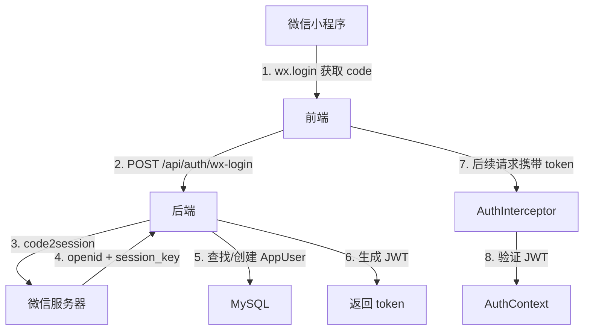

# 认证与鉴权

## 整体流程



## 微信小程序登录

### 登录流程

1. 小程序端调用 `wx.login()` 获取临时登录凭证 `code`
2. 将 `code` 和可选的用户信息发送到 `POST /api/auth/wx-login`
3. 后端使用 `code` 向微信服务器调用 `jscode2session` 接口
4. 获取 `openid`、`unionid`（可选）、`session_key`
5. 根据 `openid` 查找或创建 `AppUser` 记录
6. 生成 JWT Token，更新到用户记录
7. 返回 Token 和用户信息

### 开发模式

当 `wechat.mini-app.app-id` 或 `wechat.mini-app.app-secret` 未配置时，系统自动进入开发模式：

- 不调用微信服务器
- 使用 `dev_{code}` 作为 `openid`
- 使用 `dev_session_key` 作为 `session_key`

这使得本地开发无需真实微信 AppID 即可测试登录流程。

### code2session 接口

```
GET https://api.weixin.qq.com/sns/jscode2session
  ?appid={APP_ID}
  &secret={APP_SECRET}
  &js_code={code}
  &grant_type=authorization_code
```

**响应字段：**

| 字段 | 类型 | 说明 |
|------|------|------|
| openid | String | 用户唯一标识 |
| session_key | String | 会话密钥 |
| unionid | String | 开放平台唯一标识（可选） |
| errcode | Integer | 错误码，0 表示成功 |
| errmsg | String | 错误信息 |

## JWT 机制

### Token 结构

项目自实现 JWT，基于 HMAC-SHA256 签名，格式为标准的三段式 `header.payload.signature`。

**Header：**

```json
{
  "alg": "HS256",
  "typ": "JWT"
}
```

**Payload：**

```json
{
  "uid": 1,
  "openid": "oXXXXXXXXXXXX",
  "exp": 1748304000
}
```

| 字段 | 类型 | 说明 |
|------|------|------|
| uid | Long | 用户 ID |
| openid | String | 微信 openid |
| exp | Long | 过期时间（Unix 时间戳，秒） |

### Token 生成

`JwtUtil.createToken(AppUser user, LocalDateTime expireAt)`

1. 构建 Header 和 Payload 的 JSON
2. 分别 Base64Url 编码
3. 使用 HMAC-SHA256 对 `header.payload` 签名
4. 拼接为 `header.payload.signature`

### Token 验证

`JwtUtil.parseToken(String token)`

1. 按点分割，校验三段格式
2. 重新签名，与第三段比对（使用 `constantTimeEquals` 防时序攻击）
3. 解码 Payload，检查 `exp` 是否过期
4. 返回 `JwtPayload`（userId + openid + expireAt）

### 安全特性

- **HMAC-SHA256 签名**：确保 Token 未被篡改
- **常量时间比较**：`constantTimeEquals` 防止时序攻击
- **过期检查**：`exp` 时间戳验证
- **双重验证**：JWT 解析后还会查询数据库确认用户存在

### 配置

| 配置项 | 环境变量 | 默认值 | 说明 |
|--------|----------|--------|------|
| `jwt.secret` | `JWT_SECRET` | 示例占位值 | 签名密钥，生产环境必须替换 |
| `jwt.expire-days` | `JWT_EXPIRE_DAYS` | `30` | Token 有效天数 |

> 生产环境务必通过环境变量设置强密钥。

## Token 提取

`AuthTokenFilter` 从请求中提取 Token，优先级：

1. `Authorization: Bearer <token>` — 标准 Bearer Token
2. `Authorization: <token>` — 无 Bearer 前缀
3. `token` 请求头 — 自定义 Header
4. `token` URL 参数 — Query String

提取后存入 `request.setAttribute("AUTH_TOKEN", token)`。

## 鉴权拦截

### 拦截配置

`WebMvcConfig` 注册 `AuthInterceptor`：

```java
registry.addInterceptor(authInterceptor)
    .addPathPatterns("/api/**")          // 拦截所有 /api 路径
    .excludePathPatterns("/api/auth/wx-login");  // 排除登录接口
```

### 拦截流程

`AuthInterceptor.preHandle()`：

1. **OPTIONS 放行** — 跨域预检请求直接通过
2. **获取 Token** — 从 Request Attribute 读取
3. **无 Token** — 返回 401，响应体 `{"state":"000520","msg":"未登录"}`
4. **解析 JWT** — 调用 `jwtUtil.parseToken(token)`
5. **查询用户** — 根据 `uid` + `openid` 查数据库
6. **用户不存在** — 返回 401
7. **设置上下文** — `AuthContext.setCurrentUser(authUser)` + `request.setAttribute("CURRENT_USER", authUser)`
8. **返回 true** — 放行请求

`AuthInterceptor.afterCompletion()`：

- 调用 `AuthContext.clear()` 清除 ThreadLocal，防止内存泄漏

## 用户上下文

`AuthContext` 基于 ThreadLocal 实现请求级用户上下文：

```java
// 获取当前用户 ID（未登录抛 401 异常）
Long userId = AuthContext.requireCurrentUserId();

// 获取当前用户对象（可能为 null）
AuthUser user = AuthContext.getCurrentUser();
```

### AuthUser 结构

| 字段 | 类型 | 说明 |
|------|------|------|
| id | Long | 用户 ID |
| openid | String | 微信 openid |
| nickName | String | 昵称 |
| avatarUrl | String | 头像 URL |
| gender | Integer | 性别 |

## 免认证接口

| 路径 | 方法 | 说明 |
|------|------|------|
| `/api/auth/wx-login` | POST | 微信登录 |
| `/test/**` | * | 旧版测试接口 |
| OPTIONS 请求 | * | 跨域预检 |

> `/test/**` 路径不在 `/api/**` 模式内，因此不会被 `AuthInterceptor` 拦截。
