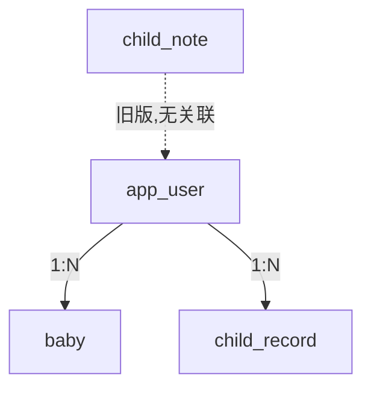
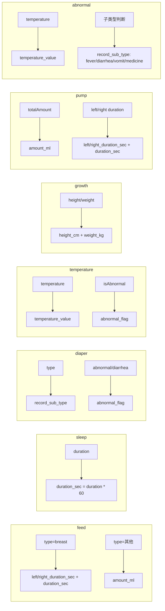

# 数据模型

## 实体关系

> 一个用户可拥有多个宝宝档案和多条记录。`child_note` 为旧版笔记表，与新业务无关联。

## 数据表详情

### app_user — 用户表

| 字段 | 类型 | 约束 | 说明 |
|------|------|------|------|
| id | BIGINT | PK, AUTO_INCREMENT | 用户 ID |
| openid | VARCHAR(128) | NOT NULL, UNIQUE | 微信 openid |
| unionid | VARCHAR(128) | | 微信 unionid |
| session_key | VARCHAR(128) | | 微信 session_key |
| nick_name | VARCHAR(128) | | 昵称 |
| avatar_url | VARCHAR(500) | | 头像 URL |
| gender | INT | | 性别 |
| token | VARCHAR(1000) | | 当前有效 JWT Token |
| token_expire_at | TIMESTAMP | | Token 过期时间 |
| created_at | TIMESTAMP | NOT NULL | 创建时间 |
| updated_at | TIMESTAMP | NOT NULL | 更新时间 |

**索引：**

| 名称 | 字段 | 类型 |
|------|------|------|
| uk_app_user_openid | openid | UNIQUE |

### baby — 宝宝表

| 字段 | 类型 | 约束 | 说明 |
|------|------|------|------|
| id | BIGINT | PK, AUTO_INCREMENT | 宝宝 ID |
| user_id | BIGINT | NOT NULL | 所属用户 ID |
| name | VARCHAR(64) | NOT NULL | 宝宝姓名 |
| avatar | VARCHAR(500) | | 头像 URL |
| gender | VARCHAR(16) | | 性别（boy/girl） |
| birth_date | DATE | | 出生日期 |
| created_at | TIMESTAMP | NOT NULL | 创建时间 |
| updated_at | TIMESTAMP | NOT NULL | 更新时间 |

### child_record — 记录表

| 字段 | 类型 | 约束 | 说明 |
|------|------|------|------|
| id | BIGINT | PK, AUTO_INCREMENT | 记录 ID |
| user_id | BIGINT | NOT NULL | 所属用户 ID |
| record_type | VARCHAR(32) | NOT NULL | 记录类型（见下表） |
| record_sub_type | VARCHAR(32) | | 子类型 |
| record_date | DATE | NOT NULL | 记录日期 |
| record_time | TIMESTAMP | NOT NULL | 记录时间 |
| amount_ml | INT | | 奶量/总量（ml） |
| duration_sec | INT | | 时长（秒） |
| left_duration_sec | INT | | 左侧时长（秒） |
| right_duration_sec | INT | | 右侧时长（秒） |
| abnormal_flag | TINYINT(1) | | 是否异常 |
| temperature_value | DECIMAL(5,2) | | 体温值（℃） |
| height_cm | DECIMAL(6,2) | | 身高（cm） |
| weight_kg | DECIMAL(6,3) | | 体重（kg） |
| payload_json | TEXT | NOT NULL | 完整记录数据（JSON） |
| created_at | TIMESTAMP | NOT NULL | 创建时间 |
| updated_at | TIMESTAMP | NOT NULL | 更新时间 |

**索引：**

| 名称 | 字段 | 类型 |
|------|------|------|
| idx_child_record_user_date_type | (user_id, record_date, record_type) | 联合索引 |

### child_note — 旧版笔记表

| 字段 | 类型 | 约束 | 说明 |
|------|------|------|------|
| id | BIGINT | PK, AUTO_INCREMENT | 笔记 ID |
| child_name | VARCHAR(64) | NOT NULL | 儿童姓名 |
| title | VARCHAR(128) | NOT NULL | 标题 |
| content | VARCHAR(2000) | | 内容 |
| note_date | DATE | | 日期 |
| created_at | TIMESTAMP | NOT NULL | 创建时间 |
| updated_at | TIMESTAMP | NOT NULL | 更新时间 |

---

## 记录类型

### record_type 枚举

| record_type | 中文名 | 子类型 record_sub_type | 摘要字段 |
|-------------|--------|----------------------|----------|
| `feed` | 喂养 | 喂养类型（breast/expressed/其他） | amount_ml, duration_sec, left/right_duration_sec |
| `diaper` | 换尿布 | 尿布类型（wet/dirty/both/dry） | abnormal_flag |
| `sleep` | 睡眠 | — | duration_sec |
| `temperature` | 体温 | — | temperature_value, abnormal_flag |
| `supplement` | 补充剂 | 类型（medicine/nutrition） | — |
| `growth` | 成长 | — | height_cm, weight_kg |
| `abnormal` | 异常 | 异常分类（fever/diarrhea/vomit/medicine） | temperature_value, abnormal_flag |
| `pump` | 吸奶 | — | amount_ml, duration_sec, left/right_duration_sec |
| `complementary` | 辅食 | — | abnormal_flag |
| `vaccine` | 疫苗 | — | — |
| `activity` | 活动 | 活动分类 | duration_sec |
| `milestone` | 里程碑 | — | — |
| `fever_resolved` | 发烧消退 | — | — |
| `diarrhea_resolved` | 腹泻消退 | — | — |
| `abnormal_resolved` | 其他异常恢复 | — | — |

### 摘要字段映射

`fillRecordSummary()` 方法将 DTO 中的关键数据同步到关系字段，用于统计查询：

### JSON Payload 结构

每种记录类型的 `payload_json` 字段存储对应的 DTO JSON：

| record_type | DTO 类 | 关键字段 |
|-------------|--------|----------|
| feed | FeedRecordDto | type, side, duration, left/rightDuration/Sec/StartTime, amount, time |
| diaper | DiaperRecordDto | type, color, urineColor, consistency, diarrhea[], abnormal, photos[], time |
| sleep | SleepRecordDto | startTime, endTime, duration |
| temperature | TemperatureRecordDto | temperature, isAbnormal, note, time |
| supplement | SupplementRecordDto | type, name, dose, note, time |
| growth | GrowthRecordDto | height, weight, time |
| abnormal | AbnormalRecordDto | temperature, respiratory[], diarrhea[], vomit, medicine, note, photos[], time |
| pump | PumpRecordDto | left/rightDuration/Amount, totalAmount, note, time |
| complementary | ComplementaryRecordDto | foodTypes[], texture, foodName, amount, amountUnit, note, photos[], reaction, abnormal, time |
| vaccine | VaccineRecordDto | name, nextName, nextDate, note, time |
| activity | ActivityRecordDto | name, category, duration, time |
| milestone | MilestoneRecordDto | title, content, date, photos[] |
| fever_resolved | — | `{}` |
| diarrhea_resolved | — | `{}` |
| abnormal_resolved | — | `{}` |

> 所有 DTO 均继承 `BaseRecordDto`，包含 `id` 字段（插入后回填）。

---

## Schema 迁移策略

项目通过 `schema.sql` 在每次启动时执行，采用 **幂等迁移** 策略：

1. `CREATE TABLE IF NOT EXISTS` — 建表幂等
2. 动态检测列是否存在 → `ALTER TABLE ADD COLUMN` — 加列幂等
3. 动态检测索引是否存在 → `CREATE INDEX` — 加索引幂等
4. 数据回填 — 将旧数据的 `user_id` 填充为第一个用户

配置 `spring.sql.init.mode=always` 确保每次启动都执行。
